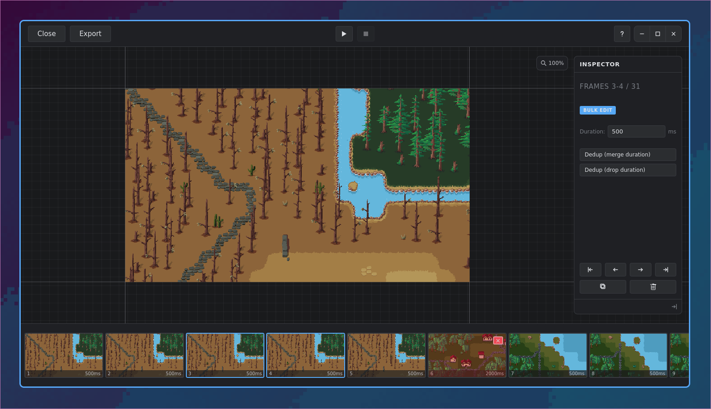

# Screeny

A cross-platform GIF recording and editing application built with Tauri, SvelteKit, and Rust.

> [!NOTE]
> The application in this repository is incomplete and under active development.

## IMPORTANT

> [!IMPORTANT]
> Unlike all of my other repositories, this is an AI-first experiment where I will try to stay as far as away from the code as I can. The goal is improve my agent-based workflows and learn more about AI-first software engineering.

## Features

- Minimalist GIF editor with a canvas, tool bar, timeline, inspector panel
- GIF playback
- Zoom in/out, move GIF around on canvas
- Basic frame management: delete/move, dedupe, change frame duration, duplicate (all available as individual and bulk operations)
- Intuitive mouse/key bindings (full list available in help menu)



## How to develop

### Using Nix Flakes, JetBrains RustRover & Direnv

You can run this project in any way you like, but I have set things up to make it easy to develop using JetBrains
RustRover. For this, you'll need:

- `direnv`
- Any Direnv integration plugin e.g. https://plugins.jetbrains.com/plugin/15285-direnv-integration
- `nix`

This way, you'll just need to `direnv allow` in the project directory after which all prerequisites (incl. Rust, Cargo,
all Bevy dependencies, etc.) will be available to you. The JetBrains plugin will ensure that the environment is
available to your IDE and you can run the project from there (vs `cargo build` and `cargo run` in the terminal).

##### How to deal with RustRover making problems again

RustRover will always fail to sync the project when you open it because it doesn't wait for `direnv`. Just re-sync
immediately after the failure and it will work.

Did RustRover forget where the Rust standard library is again? Run the below and update the path in the settings:

```shell
find /nix/store -type d -name rust_lib_src
```

##### Running out of disk space?

`cargo sweep` is your friend and comes with the Flake. For example, the below will delete all build artefacts that
are older than 7 days:

```shell
cargo sweep -t 7
```

To clean everything except for the latest build:

```
cargo sweep --stamp

<Insert any number of cargo build, cargo test, etc. commands>

cargo sweep --file
```

##### Using the Nix flake

Upgrade the flake by running `nix flake update --flake .` in the repository's base directory.

### Running tests

#### Unit tests

Frontend unit tests using Vitest:

```sh
pnpm test:unit
```

#### E2E tests

Full-stack end-to-end tests that exercise the Svelte UI, Tauri IPC boundary, and Rust backend together using WebDriver.

##### Prerequisites

1. **Build the Tauri app** (E2E tests run against the release binary):

   ```sh
   pnpm tauri build
   ```

   Note: on some Linux setups the AppImage bundling step may fail — the release binary at
   `src-tauri/target/release/screeny` is still produced and is all the E2E harness needs.

2. **Install `tauri-driver`**:

   ```sh
   cargo install tauri-driver
   ```

3. **WebKitWebDriver** must be available on `PATH`. On most Linux distributions this is provided by the `webkit2gtk` or
   `webkit2gtk-driver` package. Check:

   ```sh
   which WebKitWebDriver
   ```

4. **Display / session**: the tests launch a real GUI window, so a running display server is required. On Wayland
   compositors (e.g. Hyprland) the current session works. In headless CI, use a virtual framebuffer:

   ```sh
   # Example with weston
   weston --backend=headless &
   export WAYLAND_DISPLAY=wayland-0
   ```

5. **Test fixture**: `tests/fixtures/test.gif` must exist. It is checked into the repo. To regenerate:
   ```sh
   cargo test --manifest-path src-tauri/Cargo.toml --test generate_fixture -- --ignored
   ```

##### Running

```sh
pnpm test:e2e
```

This launches `tauri-driver` → `WebKitWebDriver` → the Screeny release binary with `SCREENY_E2E=1`, then runs 13
scenarios covering app launch, GIF open, frame selection, frame deletion, and export.

##### E2E mode

When `SCREENY_E2E=1` is set, the app exposes deterministic Tauri commands (`e2e_open_fixture`, `e2e_save_path`) that
bypass native file dialogs, using fixture/temp paths instead. This keeps tests reliable without platform dialog
automation.

Environment variable overrides:

- `SCREENY_E2E_FIXTURE` — custom path to the input GIF fixture
- `SCREENY_E2E_EXPORT` — custom path for export output (defaults to `/tmp/screeny-e2e/export.gif`)

#### Known limitations

- **macOS**: `tauri-driver` does not support macOS. E2E tests are Linux and Windows only.
- **Windows**: not yet tested or set up. `tauri-driver` supports Windows via the Edge WebDriver, but the wdio config and
  prerequisites need adapting.
- **WebKitWebDriver click interactability**: some elements require JavaScript-based clicks (
  `browser.execute(el => el.click(), element)`) because WebKitWebDriver rejects standard WebDriver clicks on certain
  toolbar buttons despite them being visible and enabled.
- **wdio v9 / `@wdio/tauri-service`**: the official Tauri wdio service requires wdio v8 and is incompatible with v9. The harness manages `tauri-driver` lifecycle manually via `beforeSession`/`afterSession` hooks.
